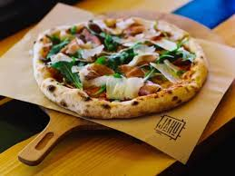
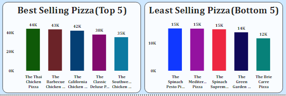
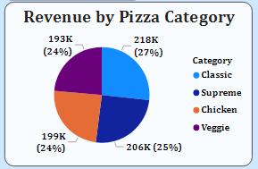
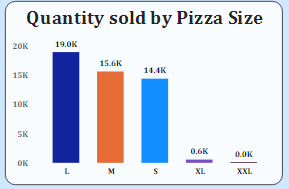
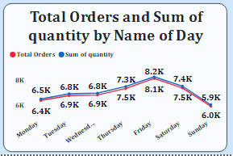
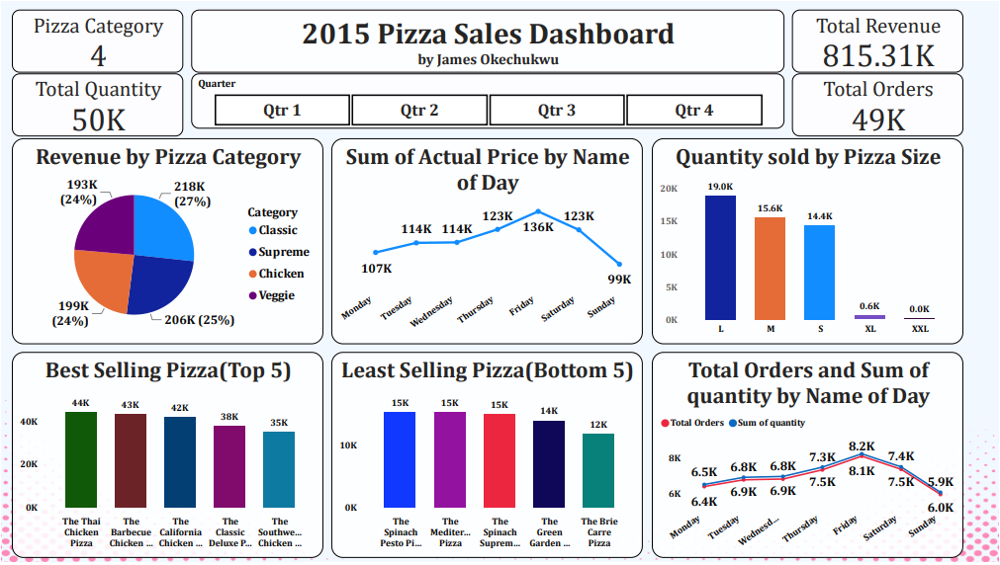

# 2015_Pizza_Sales_Analysis_PowerBI

## Introduction

The 2015 pizza sales dataset contains information about the sales volume, revenue, and customer satisfaction of pizza sales across the US. By analyzing this dataset, I  generated some insights that can help understand the pizza market and improve business strategy.

-------------------------------------------------------

## Problem Statement

1. Which pizza types are the best selling and least selling
2. Which pizza category recorded the highest revenue
3. Which pizza size was more preferred
4. What day of the week had the highest quantity of pizza order

## Skills and concept used
- Power_BI
- DAX
- Filtering
- Column addition
- Data cleaning to remove null values

## Modelling
There was no modelling deployed for this analysis

## Analysis

1. The thai chicken, berbecue and california pizza toppings were the best selling with a total order of 44k, 43k and 42k orders respectively, while the bie currie and green garden toppings had the least orders of 12k and 14k.

-----------------------------------------------

2. The 4 pizza category had a slight difference in their revenue generation with classic making the highest revenue

-----------------------------------------------  

3. The large size pizza had 19k orders, with the medium size coming behind with 15k orders while the extra large(xl) and extra extra large(xxl) sizes were least ordered

-----------------------------------------------

4. Customers made orders more on thursdays, fridays and saturdays, with fridays having the highest order, hence pizza quantity were at its peak on these days of the week.
   
----------------------------------------------

## Visualization

The dashboard of the analysis can be visualised and interacted with [here](https://app.powerbi.com/groups/me/reports/e34fa205-6923-4403-805f-32d05a6edb36?experience=power-bi&clientSideAuth=0)

Here is the visualization report 

## Conclusion and Recommendation

The pizza sales analysis have shown customers' preference of pizza consumption with the type of pizza preferred and the day of the week in which they are mostly orderd.
From this analysis the pizza market can invest more in the pizza toppings that is best ordered irrespective of the category and produce more pizzas during weekends.

------------------------------------------------
